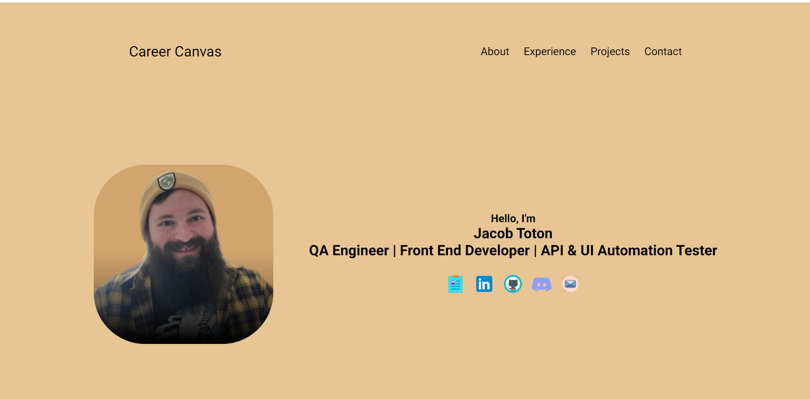

# Career-Canvas

## Description

• Welcome to my website showcasing responsive layout design! This site was meticulously crafted, to the best of my current ability, to adapt seamlessly to various devices and screen sizes, ensuring a good viewing experiences for all users. As a portfolio piece, it highlights my ability to creating user-friendly designs that prioritize accessibility and functionality.

Using semantic elements and advanced CSS techniques like flexbox control, I've structured the page for ease of navigation. Each section is tagged to enable smooth scrolling and quick access to relevant content, enhancing user engagement and interaction.

Viewing my site on a desktop, tablet, or mobile device should create a friendly experience with fluid layouts and dynamic elements that adjust to multiple screen sizes. This portfolio is a showcase of my current abilities and sklills regarding responsive designs.

Additionally, I decided to go outside the scope of the project to learn more as my interest was peeked around certain areas. This is in regard to the icon controls and multiple responsive states that I think add to user experience and legibility.

I spent some time using differing color palletes and icons to attempt to style the page rather than having a simple white or black background.

I was met with challenges using flexboxes in addition to gradiants and color controlers.
Ultimately, I wasn't able to achieve full artistic vision within this project but I have certainly learned more than I could previously and will be applying this knowledge to future endevours.

## Link to Deployed Application.

• [https://jtoton.github.io/Accessibility-Refactoring-Challenge/]

## Table of Contents:

- [Installation](#installation)
- [Usage](#usage)
- [Credits](#credits)
- [License](#license)
- [Mockup](#Mockup)
- [Badges](#Badges)
- [Features](#Features)
- [Contributions](#Contributions)
- [Tests](#Tests)
- [Citations](#Citations)
- [NewCitations](#NewCitations)

## Installation

• There are no installation steps required. The project is housed within a GitHub repository that has an index.html file within it. All assets and files are included within the folders and sub-folders located on the repo.
If one wanted to pull the repo to examine the project in detail then cloning the repository would be the only step required. Otherwise the link is live and can be accessed here on GitHub.

## Usage

• Website usage is limited to accessing the url via the index.html provided. Opening the link will show that it is a single page that has information located on the main landing page.
There is a list of information regarding a mock business that details search engine optimization, reputation management as well as social media marketing.
Additionally, more information on how lead generation, brand awareness and cost managment can assist in any business.

## Credits

• All credit for the materials, files and code are giving to the bootcamp instructors and the information provided within the course material.

• Information and details can be found here: [https://bootcampspot.instructure.com/courses/5301/assignments/74767?module_item_id=1209851].

• Additionally, the base project was cloned from this repository (README and Instructions). [https://git.bootcampcontent.com/University-of-Utah/UofU-VIRT-FSF-PT-02-2024-U-LOLC].

• Other examples or assistance was located from: [https://www.w3schools.com/html/html5_semantic_elements.asp].

• Any and all other information gathered was located via links provided in the previously cited school links which housed other resources and links to view and learn from.

## License

• This project has a standard MIT license. Source: https://choosealicense.com/licenses/mit/

• This license seemed appropriate given that it will be accessed, cloned and assessed by any and all who may be performing a review, assessment or grading of the project and my work herewithin.

## Badges

## Mockup

## Features

• index.html file that houses the code for the project and links together all assets used within it.

• css file used to dictate the style of the webpage.

• script.js to control state changes within a dropdown menu.

• mediaqueries.css to control all media screen flex adjustments for different devices.
This was something that I picked up online and greatly used to my benifit by having a
more organized structure.

• Images that are nested within the HTML and CSS to be presented on screen.

## Contributions

• Contribuation are not welcome and or accepted.

• This project is a graded assignment that will reflect my progress within the first 1 to 2 weeks of class.

• However, it will be accessed, cloned and accessed by any and all who may be performing a review, assessment or grading of the project and my work herewithin.

• That being said, any of the aforementioned representatives of the school or private company that are responsible for accessing, grading or reviewing the project have expressed permission to edit, add notes, add comments or perform any work necessary to complete this task.

## Tests

• Testing has not been included within this project as of yet. I look forward to learning more about this process, given my QA experience, and adding it to the project in the future.

## Citations

• Agile Alliance. (2023, October 18). Agile Manifesto for Software Development | Agile Alliance. Agile Alliance |. https://www.agilealliance.org/agile101/the-agile-manifesto/

• CSS Property: list-style-type | HTML Dog. (n.d.). https://www.htmldog.com/references/css/properties/list-style-type/

• GitHub: Let’s build from here. (n.d.). GitHub. https://github.com/

• HTML color codes. (n.d.). HTML Color Codes. https://htmlcolorcodes.com/

• HTML Semantic elements. (n.d.). https://www.w3schools.com/html/html5_semantic_elements.asp

• HTML summary Tag. (n.d.). https://www.w3schools.com/tags/tag_summary.asp Login. (n.d.). https://bootcampspot.instructure.com/courses/5301/assignments/74767?module_item_id=1209851

• Nomensa. (2018, August 23). Multi-lingual website accessibility — 7 tips and techniques. Medium. https://medium.com/@Nomensa/multi-lingual-website-accessibility-7-tips-and-
techniques-f8c95a5121ac

• Nomensa. (2023a, April 26). Humanising Technology blog - UX, web accessibility and design | Nomensa. Nomensa. https://www.nomensa.com/blog/ Nomensa. (2023b, June 6). What is a
screen reader? Nomensa. https://www.nomensa.com/blog/what-screen-reader/

• OpenAI. (2023). ChatGPT (Mar 14 version) [Large Language model]. (n.d.). ChatGPT (Mar 14 Version) [Large Language Model]. https://chat.openai.com/chat

-NOTE: ChatGPT was only used to assist in creating dialog for the README file. The OpenAI software was not used to assist in any code generation, HTML edits, CSS edits or
otherwise any of the assets located within the repository other than this README specifically. The software was used to assist in creating a professional README.md file that
would meet standards within the industry (to the best of my knowledge). Additionally, school resources, linked within the citations already, were used in combination to flush
out the design.

• Scientific, F. (n.d.). Downloads: JAWS. https://support.freedomscientific.com/Downloads/JAWS

• GitLab. (n.d.). https://git.bootcampcontent.com/University-of-Utah/UofU-VIRT-FSF-PT-02-2024-U-LOLC

• Specificity - CSS: Cascading Style Sheets | MDN. (2023, November 22). MDN Web Docs. https://developer.mozilla.org/en-US/docs/Web/CSS/Specificity

• What makes up a web development project? (n.d.). The Full-Stack Blog. https://coding-boot-camp.github.io/full-stack/web-development/web-dev-project

• All other links, sources and information gained and used within the project were found or otherwise located within the above sources(sublinks within the above links). The
classwork, modules, TA's, as well as the instructor provided a multitude of links within the assignment itself as well as within class demonstrations and our communication
through slack and or discord.

• All previous resources were additionally used within this project. However more resources were used within as I attempted to create more advanced sections within the . js .css and index file for my first porfolio attempt.

## NewCitations

• Child elements expanding outside parent element with flex. (n.d.). Stack Overflow. https://stackoverflow.com/questions/42536619/child-elements-expanding-outside-parent-element-with-flex

• Curriculum | University of Utah Professional Education Coding Boot Camp. (2024, March 6). University of Utah Professional Education Boot Camps. https://bootcamps.continue.utah.edu/coding/curriculum/

• Download 1,341,900 free icons (SVG, PNG). (n.d.). https://icons8.com/icons

• YouTube. (n.d.). https://www.youtube.com/, "Great Stack","How to become a developer","Tahmid Ahmed, "Codehal","Here's the code."

• How to use an image as a link in HTML? (n.d.). https://www.tutorialspoint.com/How-to-use-an-image-as-a-link-in-HTML Linking to a pdf file with html. (n.d.).

• Stack Overflow. https://stackoverflow.com/questions/36899940/linking-to-a-pdf-file-with-html Mojeed, I. (2022, November 4).

• How to create a responsive image gallery with CSS flexbox - LogRocket Blog. LogRocket Blog. https://blog.logrocket.com/responsive-image-gallery-css-flexbox/

• picofme.io | AI profile picture maker. (n.d.). https://picofme.io. https://picofme.io/

• Roboto - Google Fonts. (n.d.). Google Fonts. https://fonts.google.com/specimen/Roboto?sort=popularity
